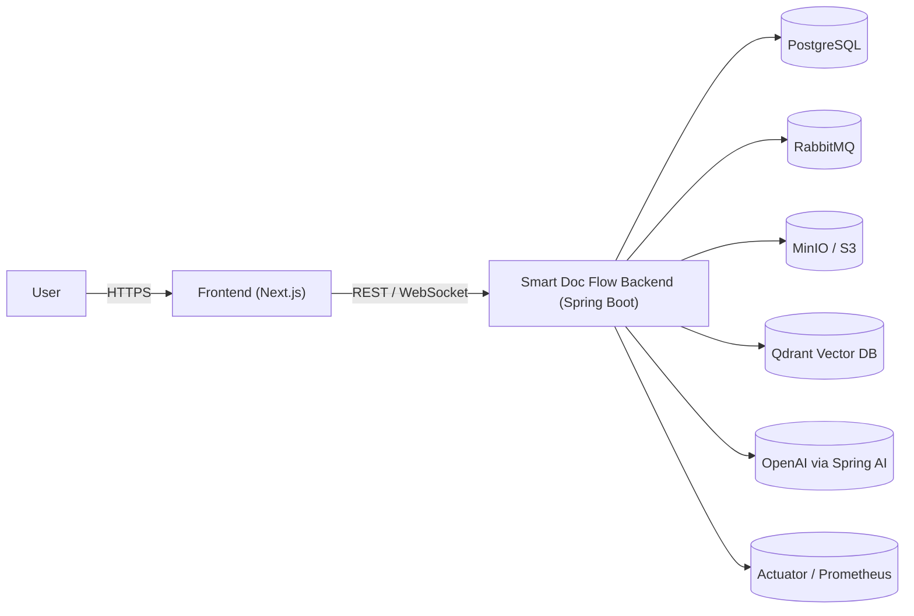
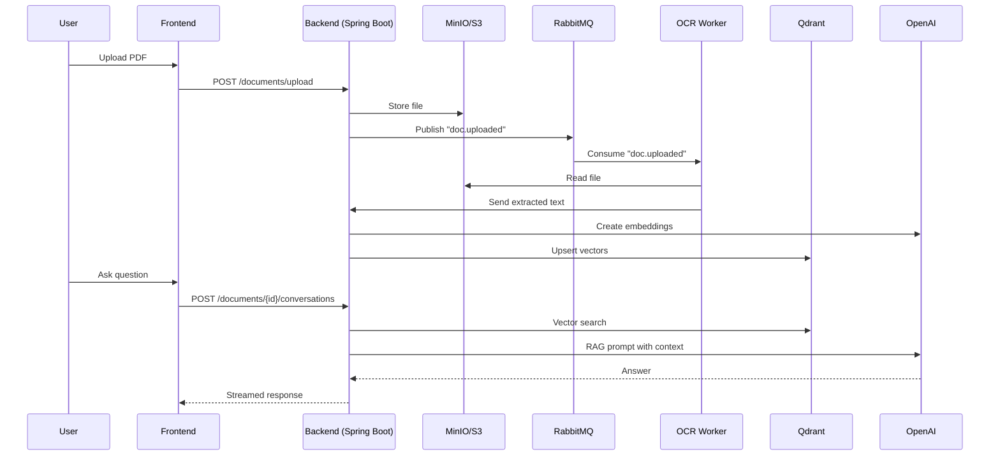

# 🧠 Smart Doc Flow (Backend)

**AI-powered document ingestion, review, and Q&A backend** built with **Spring Boot**, **JWT authentication**, **vector
search (Qdrant)**, and **S3-compatible storage**.  
Designed for production scalability, modular domain architecture, and enterprise-level security.

<p align="center">
  
  
  
  
  
  
  
  
</p>

---

## 🚀 Elevator Pitch

- Upload PDFs and instantly transform them into searchable knowledge bases using AI-powered parsing and vector indexing.
- Secure, JWT-based authentication with refresh rotation and role-based access control.
- Modular, clean architecture built on **ports/adapters** for easy extensibility and testing.
- Full observability via Prometheus, Actuator, and structured MDC logging.

---

## 🌐 Live Demo / Screenshots

- **Live Demo:** _TBD (add link if deployed)_
- **Screenshots:** _TBD (upload examples of upload/review/chat views)_

---

## 🏗️ Architecture Overview

The backend exposes REST APIs under `/api` and WebSocket endpoints for live interactions.  
Each document is processed (PDF → text/OCR → embeddings) and indexed in **Qdrant** for retrieval-augmented chat (RAG).  
Storage is handled by **S3/MinIO**, background processing via **RabbitMQ**, and persistence in **PostgreSQL**.





---

## ⚙️ Tech Stack

**Languages & Frameworks:** Java 21, Spring Boot 3.4, Spring Security, Web, Data JPA, WebSocket, Lombok, MapStruct  
**AI & Retrieval:** Spring AI (OpenAI models + embeddings), Qdrant, JDBC Chat Memory  
**Data & Infra:** PostgreSQL, RabbitMQ, MinIO/S3, Apache PDFBox, OCR adapters  
**DevOps & Observability:** Maven, Actuator, Micrometer Prometheus, Logback (MDC), JUnit 5, Mockito, Testcontainers

---

## ✨ Core Features

- 🔐 **Secure Authentication:** JWT access + refresh token rotation, role-based RBAC
- 📄 **Document Lifecycle:** Upload, storage, metadata, presigned downloads, deletion, and statistics
- 💬 **AI Conversations:** RAG-based per-document chat with contextual Q&A
- 👥 **User Management:** Profile updates, password resets, and admin dashboards
- 📊 **Observability:** Health metrics via Actuator & Prometheus, structured logs with correlation IDs

---

## 🧩 Getting Started

### Prerequisites

- Java 21
- Maven (or `mvnw`)
- PostgreSQL ≥ 14
- RabbitMQ
- MinIO (S3-compatible)
- Qdrant (vector DB)
- OpenAI API key (for Spring AI)

### Local Quickstart

```bash
# 1. Start dependencies manually or via docker-compose (if available)
# 2. Set required environment variables (see below)
# 3. Run the backend
./mvnw spring-boot:run

# API available at:
http://localhost:8080/api
```

### Environment Variables

```bash
# Database
DB_URL=jdbc:postgresql://localhost:5432/postgres
DB_USERNAME=docroot
DB_PASSWORD=change-me

# OpenAI / AI Providers
OPENAI_API_KEY=sk-...

# JWT Tokens
JWT_ACCESS_SECRET=a-strong-secret
JWT_ACCESS_EXPIRATION=900000          # 15 min
JWT_REFRESH_SECRET=a-strong-secret
JWT_REFRESH_EXPIRATION=604800000      # 7 days

# Object Storage (MinIO)
MINIO_URL=http://localhost:9000
MINIO_ACCESS_NAME=minioadmin
MINIO_ACCESS_SECRET=change-me

# RabbitMQ
RABBIT_MQ_USERNAME=guest
RABBIT_MQ_PASS=guest
RABBIT_MQ_PORT=5672

# Cryptography (Conversations)
CONVERSATION_SECRET=base64-encoded-key
CONVERSATION_FINGERPRINT_SECRET=base64-encoded-key

# Email (SMTP)
EMAIL_USERNAME=your-email@example.com
EMAIL_PASSWORD=app-specific-password

# CORS / Frontend
FRONTEND_URL=http://localhost:3000
```

---

## 🧠 API Quick Tour

> 📘 **Swagger UI:**  
> Interactive documentation available at **`http://localhost:8080/swagger-ui.html`** (or `/swagger-ui/index.html`) once
> the application is running.

**Auth Notes:**

- Send `Authorization: Bearer <access_token>` in headers.
- Refresh tokens rotate automatically and are stored in secure, HTTP-only cookies.
- CSRF protection is disabled for stateless APIs.
- CORS allows requests only from `FRONTEND_URL`.

---

## 🧪 Testing & Quality

- **Unit Tests:** JUnit 5 + Mockito
- **Integration Tests:** Testcontainers (PostgreSQL, RabbitMQ)
- **Commands**
  ```bash
  ./mvnw test         # Run unit tests
  ./mvnw verify       # Run integration tests
  ./mvnw package      # Build JAR
  ```

---

## 🚢 Deployment

- **CI/CD:** (Planned) GitHub Actions or Jenkins pipelines for build → test → deploy.
- **Containerization:** Build with Maven and deploy the generated fat JAR.
- **Runtime:** Default port `8080`; base path `/api`.
- **Scalability:** Horizontally scalable with shared PostgreSQL, RabbitMQ, Qdrant, and MinIO.
- **Reverse Proxy:** Recommended setup with Nginx and HTTPS (TLS).

---

## 🔐 Security & Compliance

- **JWT Auth:** Access & refresh rotation with persistent refresh token store.
- **RBAC:** Method-level `@PreAuthorize` enforcement per role (ADMIN, REVIEWER, USER).
- **Secrets:** Loaded from environment variables only.
- **CORS & CSRF:** Stateless CORS; CSRF disabled for APIs.
- **Actuator Exposure:** Restricted to internal network in production.
- **Transport Security:** Enforce HTTPS/TLS in all environments.

---

## 📈 Performance & Observability

- **Vector Search:** Chunked document embeddings in Qdrant for low-latency retrieval.
- **Async Processing:** RabbitMQ streams for OCR and embedding pipelines.
- **Metrics:** Micrometer → Prometheus for monitoring.
- **Logging:** Logback + MDC (requestId, user, clientIp) for full request tracing.
- **Actuator:** Health, metrics, and system info endpoints enabled.

---

## 🧾 License

This project is licensed under the **MIT License** — see the [LICENSE](./LICENSE) file for details.